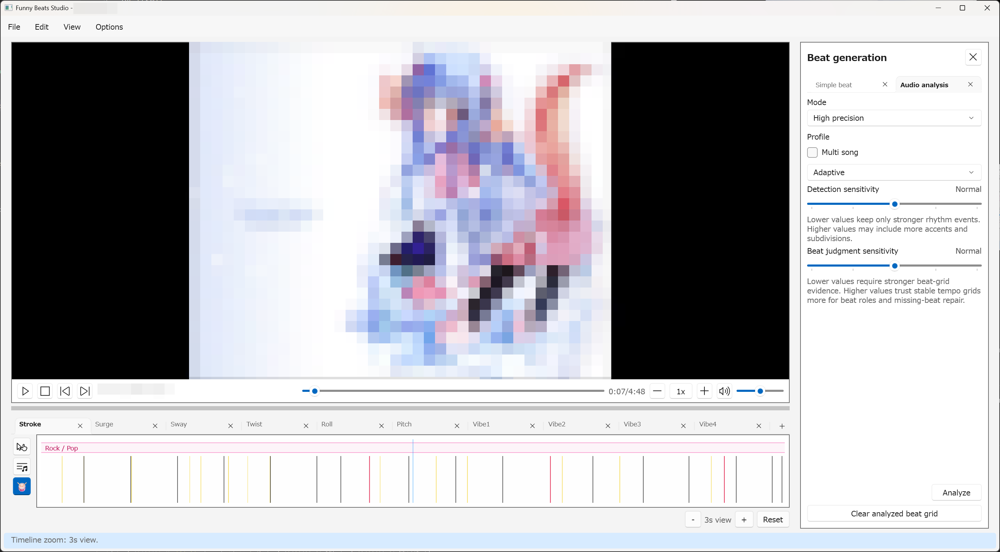

# Beat Analysis and Editing

Beat analysis creates the timing grid used by snapping, beat editing, unified
audio/beatbar timing, and motion generation. It does not create `.funscript`
motion points by itself.

## Open the Beat generation panel

Use `View > Beat generation` or press `Ctrl+1`.

The panel has two main paths:

- `Simple beat` creates a BPM grid from typed values.
- `Audio analysis` analyzes the loaded video's audio and stores detected beat
  and accent markers in the project.

## Simple beat

Use `Simple beat` when you already know the song tempo or want a clean starting
grid without running audio analysis.

The inputs are:

- `Offset ms`: timestamp of the first generated beat.
- `BPM`: tempo in beats per minute.
- `Beats per measure`: primary beat-grid pulses in each generated measure.

Click `Generate simple beat` to replace the current beat grid. Generation
requires a loaded video with a known positive duration.

Simple beat also creates a user meter region. Its first complete measure starts
at the typed offset, its initial grouping is one group containing all selected
pulses, and its notated time signature is left unknown. Use `Structure` >
`Meter boundary` later if you want grouping such as `2+2` or an explicit
notation value.

## Audio analysis modes

The `Audio analysis` tab exposes these modes:

- `Instant`: fastest local full-mix analysis.
- `Fast`: percussion-focused local analysis with fallback behavior when needed.
- `High precision`: stem-assisted analysis for difficult rhythm
  material.

All three modes evaluate actual meter and phase evidence. `Instant` and `Fast`
do not label every fourth beat merely because analysis completed. When evidence
is ambiguous, the result may have no confirmed downbeats and may instead expose
a reviewable meter proposal. The completion status reports the downbeat count,
the reason when none were confirmed, and whether a candidate is available.

`High precision` requires the optional Python runtime and stem analysis assets.
If those assets are not verified, the panel chooses `Fast` by default.

## High precision controls

When `High precision` is selected, the panel adds profile and sensitivity
controls:

- `Profile`: choose `Adaptive`, `Auto`, `Balanced`, or a genre-oriented profile
  such as electronic, rock/pop, hip-hop/trap, bass-driven, dense fills, or
  live/acoustic.
- `Multi song`: propose and confirm song regions before analyzing each region.
- `Detection sensitivity`: lower values keep only stronger rhythm events;
  higher values may include more accents and subdivisions.
- `Beat judgment sensitivity`: lower values require stronger beat-grid
  evidence; higher values trust stable tempo grids more when promoting accents
  to beats and repairing missing beats.

For a first pass, use `Adaptive` with both sensitivity controls at `Normal`.
Move sensitivity one step at a time and review the timeline after each run.

## Multi song analysis

Use `Multi song` when one video contains multiple songs or obvious tempo
sections. The workflow proposes boundaries, then asks you to confirm, delete,
add, or move boundaries on the timeline before final analysis.

Confirmed regions are analyzed independently and merged back into absolute
timeline positions. This avoids one song's tempo or profile forcing the rest of
the video into the wrong grid.

## Beat, accent, and downbeat markers

`Beat` markers are materialized musical events for snapping and editing. A
separate structural pulse grid preserves meter and generation position even
when a non-anchor Beat marker is deleted, changed to an Accent, inferred, or
hidden by a display filter.

`Accent` markers are extra timing hints. Use them for offbeats, pickup notes,
rapid decoration, and fill moments that should help editing or generation
without changing the primary beat count.

Confirmed measure starts are red on every beat timeline, even in Unified.
Intermediate grouping starts have a weaker emphasis. Pending meter proposals
are shown as Suggested region cards with dashed measure and group projections
under `Structure` > `Meter boundary`. They are not downbeats and do not affect
motion generation until accepted.

## Open Beat editing

Use `Edit > Beat editing...` or press `Ctrl+B`.

The Beat editing panel helps repair selected beat and accent markers after
analysis. It works on the beat-grid layer, not on script point axes. See
[Beat editing](./beat-editing.md) for the dedicated beat-grid repair guide.

Meter regions, proposals, confidence, reasons, boundaries, and anchors are not
shown in that panel. Choose the vertical `Structure` layer and then the `Meter
boundary` tab to review or edit them. When analysis produces pending proposals,
the app opens that tab for review; confirmed-only results leave the current Beat
grid view unchanged.

## Common beat edits

Use these commands when the analysis is close but not perfect:

- `B`: add a beat at the playhead.
- `A`: add an accent at the playhead.
- `Delete`: delete selected beat or accent markers on the Audio tab, or
  committed beatbar hits on the Beatbar tab.
- `Fill from selected tempo`: project missing beats forward or backward from
  selected beats.
- `Redistribute run`: keep the selected run endpoints and space interior beats
  evenly.
- `Clear accents`: remove accent markers from a selected span.

Beat editing commands preserve unrelated markers and are undoable when they
commit a change.

## Review and edit meter

The `Meter boundary` tab shows confirmed definitions as bounded region cards on
a faint Audio primary-beat grid. Red lines are measure starts, weaker lines are
group starts, and both remain visible when no marker exists at that structural
slot. The start and end edges are full-height resize grips. A compact grip at
the bottom marks the first complete measure anchor, so it remains selectable
when it shares a timestamp with the start edge.

Sections with candidates show one Suggested card each. Sections without a
usable candidate remain available in diagnostics but leave this editing
timeline blank. Use the viewport-fixed `Candidate n/N` navigator to compare the
selected section's non-rejected alternatives, then right-click the Suggested
card to accept, reject, or edit and apply it. The card includes rank, pulse
count, grouping, score, and reason. Switching alternatives is session-only;
accepting or rejecting is an undoable project change.

Double-click a primary beat, or use a region context menu, to open the inline
Meter editing rail above the timeline. Set pulse count, a grouping whose parts add to that count, and an
optional time signature. The new-definition default is `4` pulses grouped
`2+2`, with notation unknown. Use the same timeline menu to add or remove a
meter change or set the current measure start.

Drag a region edge or anchor grip to resize or rephase confirmed meter. Anchors
snap to Audio primary beats. Edges also accept exact song endpoints and an
adjacent confirmed-region edge, even when that edge has no materialized Beat.
The preview does not mutate the project; release commits one Undo entry. Actual
song boundaries cannot be crossed, but analyzer-derived pause boundaries do not
lock editing. Invalid overlaps and crossing adjacent anchors are rejected.
Operation results and warnings appear in the bottom status bar.

For older map-free data, the empty `Meter boundary` menu can create a Pending
single-group, unknown-notation proposal from stable legacy downbeats. Direct
downbeat flag editing remains available only for that older map-free case.

## Timing repair

The Beat editing panel includes timing tools:

- fixed nudge values such as `-10 ms`, `-5 ms`, `-1 ms`, `+1 ms`, `+5 ms`, and
  `+10 ms`;
- frame-step nudge when the loaded video frame rate is known;
- typed shift offsets;
- stretch range controls.

Use small nudges when a section is consistently early or late. Use stretch only
when the first and last selected markers are trustworthy and the interior timing
needs retiming across that span.

## Suggested workflow

1. Run `Audio analysis`.
2. Watch a short section and compare beats against the video.
3. Add or delete obvious markers.
4. Use `Fill from selected tempo` or `Redistribute run` for local gaps.
5. Open `Structure` > `Meter boundary` to define or review important regions;
   compare candidates and accept one only after checking its projected phase.
6. Save the project before motion generation.

Beat analysis is usually worth reviewing before generation. A clean beat grid
makes generated motion easier to edit.
