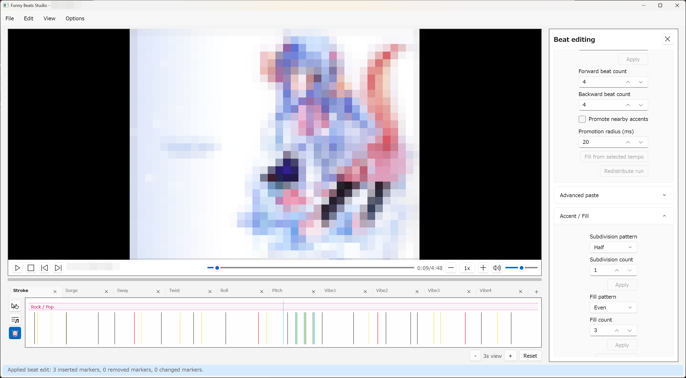

# Beat Editing

Beat editing repairs the project beat grid after simple beat generation, audio
analysis, beatbar analysis, import, or manual edits. The beat grid drives
snapping, alignment, beatbar-assisted workflows, and motion generation timing.

## Beat grid layer

Beat commands work in the Beat grid timeline layer, separate from point
editing. Selecting one beat or accent seeks playback to that marker timestamp.
Selecting multiple markers changes only the beat selection.

The Beat grid layer has three source tabs:

- `Mixed`: read-only comparison of audio beats and beatbar hits.
- `Audio`: editable audio beat grid.
- `Beatbar`: editable committed beatbar hits.

Markers have three common meanings:

- `Beat`: primary rhythm markers used for beat order and ordinary snapping.
- `Accent`: extra timing hints for offbeats, pickups, and fill moments.
- `Downbeat`: a beat marked as a measure start.

Downbeats render distinctly on the timeline. Accents do not become downbeats.

## Add, select, and delete markers

Use:

- `B` or `Edit > Add beat at playhead` to add a beat at the playhead;
- `A` or `Edit > Add accent at playhead` to add an accent at the playhead;
- `Delete` to remove selected beat or accent markers.

Right-click the beat timeline for context commands. With no marker selected,
the menu offers location-aware add commands. With a marker selection, the menu
offers selection commands such as delete, toggle beat/accent, toggle downbeat,
selection filtering, midpoint insertion, and span repair entries.

Committed beatbar hits are edited from the `Beatbar` tab. Use `Delete` for
false positives, or the same beat-repair timing commands used by Audio when
the command is not accent, downbeat, or measure-start specific.

Beat edits are undoable when they commit a change. Duplicate timestamps and
other no-op edits report no change instead of creating Undo entries.

## Advanced paste

Select beat or accent markers in the Beat grid layer and copy them with
`Ctrl+C`. In `Edit > Beat editing...`, use `Advanced paste` below Beat repair
to paste the copied marker pattern at the current timestamp.

- `Backward` uses the current timestamp as the pasted sequence end.
- `Mirroring backward` also uses the current timestamp as the end, but mirrors
  the copied timing.
- `Overwrite` controls whether markers at matching timestamps are replaced or
  skipped.
- `Repeat count` pastes consecutive copies of the copied pattern.

## Repair missing or extra beats

Use these commands when the analysis is close but needs local repair:

- `Insert midpoints`: add one marker between selected primary beats.
- `Fill selected span with beats`: add a typed number of evenly spaced beats
  inside two selected endpoints.
- `Fill from selected tempo`: project beats before or after the selected beat
  using the current estimated BPM.
- `Redistribute run`: keep selected run endpoints and space interior beats
  evenly.
- `Delete`: remove false-positive selected beat, accent, or committed beatbar
  hit markers.

Accent repair commands add timing hints without changing the primary beat
sequence. Use accent subdivisions or accent fills for rapid decoration moments,
then clear accents in a span when there are too many.

Beatbar hit markers support timing edits only, so accent, downbeat, and
measure-start commands are available only on the `Audio` tab. Beatbar fill from
selected tempo is available when an audio beat grid has an estimated BPM.

## Timing repair

Open `Edit > Beat editing...` or press `Ctrl+B` for settings-driven beat
editing commands.

The Timing section supports:

- fixed nudges such as `-10 ms`, `-5 ms`, `-1 ms`, `+1 ms`, `+5 ms`, and
  `+10 ms`;
- frame-step nudges when the loaded video frame rate is known;
- typed signed shifts in milliseconds;
- stretch controls for retiming a selected range.

Use nudges for small consistent offsets. Use stretch only when the selected
start and end markers are trustworthy and the interior timing needs retiming
across that span.

## Meter and downbeats

Use `Mark downbeat` and `Clear downbeat` for direct correction of selected
primary beats.

Use `Set measure start` when one selected primary beat should become the phase
reference for the section. The app recalculates downbeats across the primary
beat sequence using the selected beats-per-measure value.

## Suggested beat repair workflow

1. Generate or import a beat grid.
2. Watch a short section and compare markers against the video.
3. Delete obvious false positives.
4. Add missed beats or accents at the playhead.
5. Use midpoint, fill, or selected-tempo repair for local gaps.
6. Nudge or stretch sections only after the marker count looks right.
7. Correct downbeats before using beat-aware motion generation.

Good beat editing makes point editing faster. When point snapping feels wrong,
return to the beat grid and repair the timing source first.
