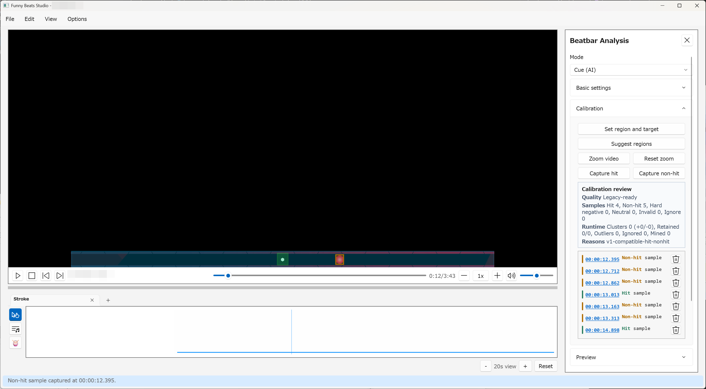

# Beatbar Analysis

Beatbar analysis detects visual cue hits from the loaded video. It is useful
when the video contains an on-screen beatbar, target marker, cue animation, or
other repeated visual timing signal.

## Open the Beatbar Analysis panel

Use `View > Beatbar Analysis` or press `Ctrl+2`.

Beatbar analysis needs:

- a loaded video;
- configured `ffmpeg` and `ffprobe`;
- a calibrated beatbar or target region;
- detector settings that match the visual cue.

`State` does not require optional AI assets. Cue (AI) and State (AI) require
verified Beatbar AI assets from `Options > Beatbar AI Model`. When those assets
are available, Cue (AI) is the normal default for visible cue events.

## Calibration concepts

The calibration overlay is drawn directly on the video. The chosen regions can
be reused even when the window size changes.

Important regions:

- `Beatbar region`: the larger visual area containing the cue or bar.
- `Target region`: the smaller region or target state to detect.
- Reference samples: saved examples of hit moments, visible non-hit moments,
  or AI sample roles.

Use `Set region and target` to draw the regions. Use `Suggest regions` when you
want the app to propose likely beatbar rectangles, then confirm or redraw the
right one.

## Detector choices

Choose one of the three current detector styles:

- `Cue (AI)`: default model-backed cue-event detection for moving markers,
  arrivals, crossings, contacts, dense cue rows, and cue artwork that changes
  over time.
- `State (AI)`: model-backed target or instruction-state detection for flashes,
  glows, occlusion, target-state changes, or layouts with no reliable cue
  trajectory.
- `State`: non-AI fallback for simple target-state flashes or when optional AI
  assets are unavailable.

Standalone `Cue tracking` is retired. Do not use old cue-template setup
instructions for new projects.

## Cue (AI) setup

Use Cue (AI) when a visible marker or cue event is the clearest timing signal.

1. Set the beatbar and target regions.
2. Choose or confirm the cue travel direction and anchor when the panel exposes
   those scorer hints.
3. Capture clear hit and visible non-hit examples.
4. Click `Preview`.
5. Adjust the selected Cue preset, `Min interval ms`, confidence threshold, or
   `Timing offset ms` if preview hits are too dense, missing, or consistently
   early/late, then click `Preview` again.
6. Use `Recommend settings` when available, then review the pending full-scan
   result before applying it.

Cue (AI) does not require the retired cue-template setup used by older guides.

## State setup

Use `State` when the target area flashes, fills, changes color, or otherwise
enters a visible hit state and you do not need the optional AI assets.

1. Set the beatbar and target regions.
2. Capture at least a few clear hit and non-hit examples.
3. Click `Preview`.
4. Adjust `Detection`, `Release`, `Min interval ms`, and `Timing offset ms`, then
   click `Preview` again.
5. Run `Analyze full video` once preview hits look reasonable.

If detection chatters, raise `Min interval ms` or adjust threshold values. If it
misses obvious hits, lower the detection threshold carefully or try State (AI)
for a more robust model-backed state scorer.

## State (AI)

Use `Options > Beatbar AI Model` before using State (AI). The app verifies the
required local AI assets before enabling model-backed analysis. Projects can be
shared without including those local assets.

For State (AI):

- capture clear `Hit` examples;
- capture clear visible negative examples from the same target region;
- avoid occluded or ambiguous samples;
- use `Recommend settings` after sample capture when available;
- review `Calibration review` quality before full scan.

If the AI guidance says calibration is insufficient, add clearer samples,
remove mistaken samples, tighten the target region, or fall back to `State`.

## Preview before full scan

Always use `Preview` before `Analyze full video`.

Preview lets you check a bounded section quickly. Full scan processes the video
and stages a pending result after success. If a full scan is canceled or fails,
the previous valid result is preserved.

Changing an accuracy or post-processing setting clears the displayed preview.
It does not rerun preview automatically. Click `Preview` when you are ready to
check the new values; the app may reuse retained scoring output when the media
and calibration still match.

Review the pending cue markers on the timeline before applying them. Pending
markers use a different color from committed markers. Use `Minimum confidence`
to hide lower-confidence final hits from the pending result; changing this
slider only changes which pending markers are visible.

Use:

- `Apply`: commit the currently filtered pending result to the project.
- `Discard`: throw away the pending result and restore the previously committed
  timeline view.

Only applied beatbar cue hits are available as a motion-generation timing
source.

## Timeline cue markers

Beatbar cue hits appear in the Beat grid layer. `Unified` shows the resolved
timing view with audio and beatbar evidence, and `Beatbar` shows committed hits
as editable markers. Pending markers are review-only until you apply the
full-scan result.

When reliable audio timing is nearby, the Unified view automatically resolves
the audio and visual evidence into one marker. The Beatbar source remains at its
visual timestamp, so changing audio analysis does not rewrite committed beatbar
hits.

To repair committed beatbar hits without rerunning analysis:

1. Switch to the Beat grid timeline layer.
2. Open the `Beatbar` tab.
3. Select the hit markers to edit.
4. Use `Delete`, midpoint insertion, fill, nudge, shift, stretch, redistribute,
   copy, or paste commands as needed.

Beatbar edits are undoable and affect committed beatbar hit markers only.
Accent, downbeat, and measure-start commands are Audio-only.

## Practical review checklist

- The calibrated region covers only the relevant visual cue.
- Preview hits align with obvious visual cue events.
- Extra repeated decorations are not being detected as hits.
- Timing offset is corrected before full scan.
- The Unified view aligns nearby audio and beatbar evidence as expected.
- AI sample labels are clean and not accidentally reversed.
