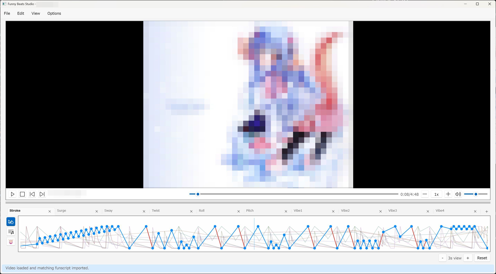

# Editor Basics

FunnyBeatsStudio is a timeline editor. Analysis and generation features create
useful drafts, but the timeline remains editable and reviewable before export.

## Main window layout

The main editor window is organized around three areas:

- The video pane shows the loaded source video.
- The playback row controls play, stop, frame stepping, seek, speed, mute, and
  volume.
- The timeline pane shows editable points, beat markers, previews, and the
  current playhead.

The status bar at the bottom reports operation progress, warnings, results, and
cancelable long-running work.

## Projects and videos

Use `File > New`, `File > Open`, `File > Save`, and `File > Close` for project
files. Use `File > Load video` to attach a local video to the current project.

When a video is loaded, its timeline starts at `00:00`. Script points and beat
markers use timestamps relative to the start of that video. Project files store
a reference to the selected video path, not a copy of the video.

Drag-and-drop can open a `.fbsproj` project or load a supported video file. If
you drop multiple items, the app uses the first recognized project or video and
ignores the rest.

## Playback and timeline sync

Playback, the current timestamp display, the timeline playhead, and visible
timeline center stay synchronized. The playhead is fixed near the center of the
timeline pane while the content scrolls underneath it.

Timeline zoom starts with a `20`-second visible window and supports windows from
`1` through `300` seconds. Zoom buttons and shortcuts keep the playhead timestamp
fixed. Mouse-wheel zoom keeps the timestamp under the pointer in place while the
scale changes and does not also scroll the timeline horizontally. Reset zoom
returns to the `20`-second view.

Useful playback controls:

- `[` decreases playback speed by `0.25x`.
- `]` increases playback speed by `0.25x`.
- `R` resets playback speed to `1x`.
- Frame-step buttons move one frame at a time for detailed inspection.

Selecting exactly one committed script point seeks the editor presentation to
that point. Selecting multiple points changes the selection without surprise
seeking.

## Timeline layers and tabs

The vertical timeline selector has three layers:

- `Points`: edit committed script points on the selected axis tab.
- `Structure`: review `Song boundary` and `Meter boundary` tabs.
- `Beat grid`: inspect `Unified` timing and edit the `Audio` or `Beatbar`
  source tabs.

The Points layer can contain multiple script axes. The visible axis tab controls
which committed points you are directly editing. Multi-axis generation and
import can populate several axes in one project.

Common axes include Stroke and companion axes such as Roll, Pitch, Twist,
Surge, Sway, and the single Vibe axis. Not every project needs every axis.

## Editing points

Committed script points are normal editable timeline data.

Use the top-level `Edit` menu for common commands:

- `Select all`
- `Copy`
- `Cut`
- `Paste`
- `Point modifiers...`
- `Add point at playhead`
- `Beat editing...`
- `Add beat at playhead`
- `Add accent at playhead`

Use the point context menu for timeline-specific commands:

- `Delete point`
- `Add point here`
- `Insert single midpoints`
- `Insert points on beat`
- `Reverse positions`
- `Snap to nearest beat`
- `Align selection to beat span`

`Enter` adds a position `50` point at the playhead without stopping playback.
This is useful for manual live tapping. If the active axis already has a point
at that timestamp, the command reports no change.

See [Point editing](./point-editing.md) for detailed point movement, snapping,
modifiers, readouts, and speed-violation review.

## Editing beats

Beat markers are edited in the separate Beat grid layer. Use `Edit > Beat
editing...` or `Ctrl+B` for settings-driven beat repair, and use `B`, `A`, and
`Delete` for quick beat-grid edits. In the Beat grid layer, use the `Audio` tab
for audio beats and the `Beatbar` tab for committed beatbar hits; `Unified` is a
read-only resolved timing view.

See [Beat editing](./beat-editing.md) for beat, accent, timing, and downbeat
repair workflows. Confirmed meter and meter suggestions are reviewed under
`Structure` > `Meter boundary` rather than in the Beat editing panel.

## Selection, Undo, and Redo

Point edits are undoable editor actions. Commands that plan multiple changes,
such as midpoint insertion or modifier application, commit as one undo entry
when possible. No-op commands should not create undo entries. Undo and Redo
preserve the current zoom and move the playhead to the first timestamp affected
by the restored edit.

Use:

- `Ctrl+Z` to undo.
- `Ctrl+Y` to redo.
- `Delete` to delete selected points in the point-editing layer.

## Visual feedback

The timeline draws point lines, selected points, beat markers, and generated
previews. Segments that exceed the active maximum speed threshold are rendered
as speed violations so you can spot motion that may be too fast.

Point tooltips show timestamp and position details. Near panel edges, tooltips
are clamped so they remain readable.

## Goods preview

Use `View > Goods preview` or `Ctrl+5` to toggle the left-side goods preview.
The preview samples the current timeline pose during playback and seeking, so it
is useful for checking multi-axis motion in context.
