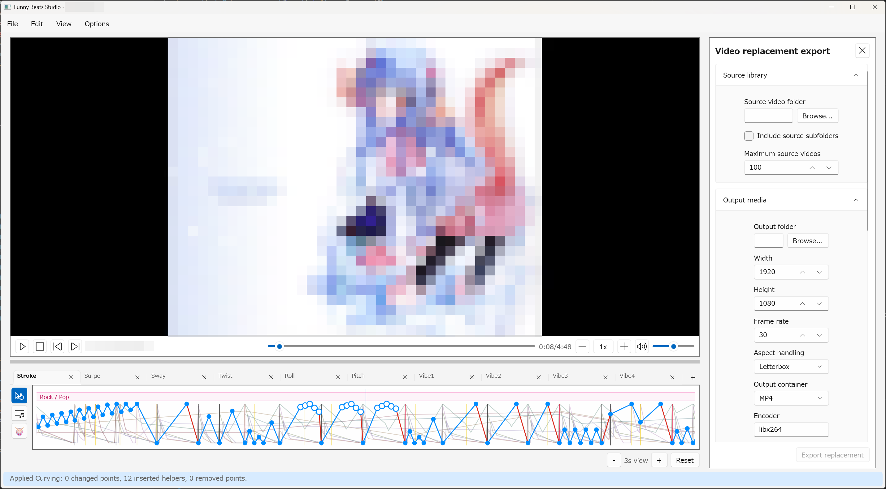

# Import, Export, and Files

FunnyBeatsStudio works with local videos, project files, `.funscript` files, and
optional rendered media output. Keep these file types separate so projects stay
portable and reviewable.



## Project files

Use `File > Save` to save a project as `.fbsproj`.

Project files store editor state such as:

- the loaded video reference and media information;
- timeline points;
- beat analysis and beat edits;
- confirmed musical meter regions and up to three review proposals per detected
  meter section;
- beatbar analysis definitions and results;
- project-level data needed to reopen the editing session.

Project files do not embed:

- source videos;
- media tools or optional analysis assets;
- generated media;
- local troubleshooting files.

Keep project files next to your working media if that helps organization, but
do not move or rename the source video without expecting to reselect or reload
it later.

Current project format version `17` keeps meter regions and review proposals
separately from detected Beat markers. It also stores a compact structural
pulse grid, so deleting or retagging a non-anchor Beat does not shift later bar
phase after reload. Older projects still open with their saved downbeat flags,
but the app does not guess grouping or a notated time signature from those
flags. Set a meter region directly, or create and review a proposal from stable
legacy downbeat spacing, when you want the old grid to gain explicit musical
structure.

Version `17` supports one vibration axis, shown in the UI as `Vibe` and stored
internally as `Vibe0`. When an older project contains points on the removed
`Vibe1`, `Vibe2`, or `Vibe3` axes, those points are discarded during loading and
are not merged into `Vibe0`. Keep a backup or convert those points before
opening and saving the project in the current version.

## Loading videos and sidecar scripts

Use `File > Load video` to attach a local video to the project.

When a video is loaded, the app looks for same-base-name `.funscript` data next
to the video. For example:

```text
example.mp4
example.funscript
example.roll.funscript
example.pitch.funscript
```

If compatible sidecar files are found, they are imported into the same timeline.
If none are found, video loading still succeeds and starts with an empty point
timeline.

## Import funscript

Use `File > Import funscript` to import script data explicitly.

The app supports community-compatible versions:

- `1.0`: standard single-axis format. Multi-axis projects use sibling files.
- `1.1`: single-file multi-axis format using an `axes` array.
- `2.0`: single-file multi-axis format using a `channels` object.

Missing `version` is treated as legacy `1.0`. Unknown versions are rejected.
Axes and channels that Funny Beats Studio does not support are ignored while
the supported motion data continues to import.

## Export funscript

Use `File > Export funscript`.

Choose the export format in `Options > Settings` under `Script export format`.
Available versions are:

- `1.0`
- `1.1`
- `2.0`

If you are not sure which format another tool expects, start with the most
compatible target for that tool and inspect the exported files before sharing.

## Version 1.0 file set

Version `1.0` writes one `.funscript` file per supported axis:

| Axis | File name |
| --- | --- |
| Stroke | `<base-name>.funscript` |
| Surge | `<base-name>.surge.funscript` |
| Sway | `<base-name>.sway.funscript` |
| Twist | `<base-name>.twist.funscript` |
| Roll | `<base-name>.roll.funscript` |
| Pitch | `<base-name>.pitch.funscript` |
| Vibe0 | `<base-name>.vib0.funscript` |

Axes with no points are still exported as valid files with an empty `actions`
array.

## Versions 1.1 and 2.0

Versions `1.1` and `2.0` store supported axes in one `.funscript` file.

In both formats:

- root `actions` is the primary stroke axis;
- each action has `at` in milliseconds and `pos` from `0` to `100`;
- actions are sorted by exported timestamp;
- axes with no points are exported with empty action arrays.

Version `1.1` uses TCode-style axis IDs such as `R1`. Version `2.0` uses channel
names such as `roll` and `vib1`. The single Vibe axis uses `.vib0` in version
`1.0` sidecar file names, `V0` in version `1.1`, and `vib1` in version `2.0`.

## Video replacement export

Use `View > Video replacement export` or press `Ctrl+4`.

This feature renders a new video by placing source-library clips against the
loaded video's beat grid. It is separate from `.funscript` export.

The main inputs are:

- source video folder;
- output folder;
- include source subfolders;
- maximum source videos;
- minimum segment seconds;
- visual switch and downbeat switch probabilities;
- transition kind and duration;
- optional 2x2 split settings;
- optional script graph overlay;
- output dimensions, frame rate, container, encoder, CRF, preset, and audio
  codec;
- loudness targets and final mix peak guard.

The workflow uses ffprobe to inspect source files and FFmpeg to render the final
media. It fails if no source video is loaded, no usable beat grid exists, the
source library has no eligible files, or FFmpeg/ffprobe cannot be resolved.

Video replacement export restores last-used folders and settings from
application settings. Generated videos and local troubleshooting details stay
outside project files.
