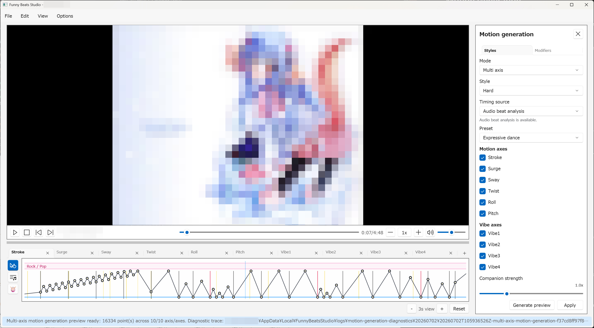
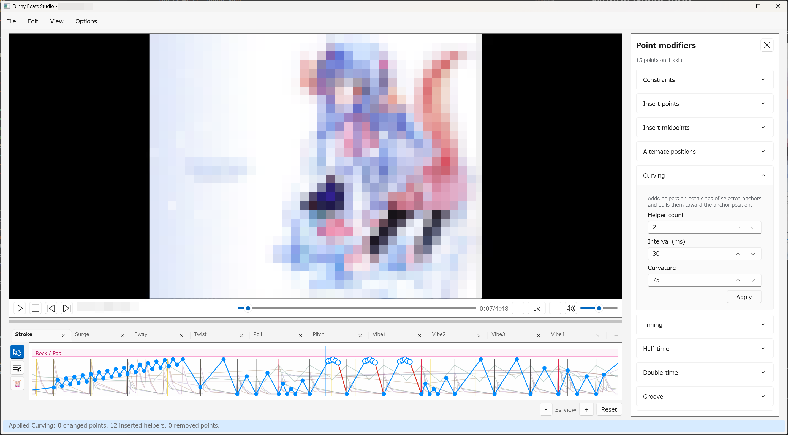

# Motion Generation

Motion generation creates editable draft `.funscript` points from the Unified
timing grid, which resolves beat analysis and committed beatbar cue evidence.
Generated points are drafts: review them, apply the useful parts, and edit the
committed timeline before export.

## Open the Motion generation panel

Use `View > Motion generation` or press `Ctrl+3`.

The panel supports:

- `Single axis`: generate one target axis.
- `Multi axis`: generate coordinated points across motion axes and the single
  Vibe axis.

The normal sequence is:

1. Create or repair timing data with beat analysis, beat editing, or beatbar
   analysis.
2. Open Motion generation.
3. Choose mode and settings.
4. Click `Generate preview`.
5. Review preview points on the timeline.
6. Apply the preview if it is useful.
7. Continue editing committed points manually.

## Unified timing grid

Generation automatically uses the current Unified timing grid, which resolves
audio, user/imported, and beatbar evidence into one timestamp-unique source.
There is no competing audio-versus-beatbar source switch.

Confirmed meter regions add bar position, pickup state, and measure/group/pulse
emphasis wherever they resolve against structural pulse evidence. A valid manual
region can remain partially unresolved; beat-aware emphasis is unavailable in
that part until Beat timing is repaired or audio analysis is rerun. A pending or
rejected meter proposal does not affect a preview. When no confirmed region is
usable, generation keeps explicit legacy downbeat flags. Only map-free user-
authored or imported timing can use fallback bar settings; analyzed Audio and
Unified timing do not invent four-beat bars. For the most musical result, review
the red measure starts and grouping emphasis under `Structure` > `Meter
boundary` first.

## Single axis mode

Use `Single axis` when you want a focused draft on one axis before adding
companion motion.

Important controls:

- `Style`: choose the generation style.
- `Target axis`: choose the axis to populate.
- `Max speed`: limit generated motion speed.
- `Min interval (ms)`: avoid overly dense points.
- `Apply mode`: choose how preview points are committed.

Single-axis generation is a good first pass because the result is easier to
inspect and edit.

## Multi axis mode

Use `Multi axis` when you want coordinated motion across several axes.

Important controls:

- `Preset`: load a starting set of enabled axes and tuning.
- `Motion axes`: enable or disable companion motion axes and Vibe.
- `Companion strength`: adjust companion movement range and intensity.
- `Companion activity`: adjust companion gesture frequency.
- `Apply mode`: choose how generated axes are merged or replaced.

Preset choices include:

- `Balanced`
- `Expressive dance`
- `Minimal companion`

Start with `Balanced`. Increase companion strength or activity only after the
baseline is reviewable.

## Apply modes

Multi-axis apply modes are:

- `Replace generated axes`: replaces existing points only on axes that have
  generated preview output. Unrelated axes are preserved.
- `Merge into generated axes`: keeps existing points and inserts preview points
  using normal axis-plus-timestamp replacement rules.

Use replace when the generated draft should become the new version of those
axes. Use merge when you have manual edits that should remain and you only want
to add generated material.

## Preview behavior

`Generate preview` is non-destructive. Preview points appear on the timeline but
are not committed until you apply them.

Changing effective generation inputs clears the current preview. Applying a
preview commits the points as one undoable editor action and clears the preview.

If every enabled axis produces zero preview points, review the status and
diagnostics and make sure the Unified grid has usable markers before changing
style controls.

## Modifier tabs

The Motion generation panel includes `Styles` and `Modifiers` tabs.

Use style controls for the broad generated pattern. Use modifier controls when
you want additional timing or motion behavior, such as:

- half-time or double-time behavior;
- groove weighting;
- build-up shaping;
- drop-lock preparation;
- call-and-response fills;
- hard beat bouncing;
- tremolo bursts;
- humanized variation.

Modifiers can make drafts busier. Increase them gradually and review the
timeline after each preview.

### Tremolo controls

The normal `Tremolo burst` section detects dense timing-event groups. Use:

- `Minimum events` and `Window (ms)` to control which groups qualify;
- `Interval (ms)` to request the spacing between generated tremolo points;
- `Amplitude` to control the requested oscillation size; and
- `Include beats` when ordinary beat markers should count toward a group.

The overall `Min interval (ms)` remains a hard lower limit on point spacing.
Nearby anchors, the maximum speed, and minimum travel can also reduce or omit
individual tremolo pairs when the requested motion cannot fit safely.

When `Fill uses tremolo` is enabled under `Call and response`, its `Tremolo
interval (ms)` and `Tremolo amplitude` controls apply only to that phrase-turn
fill. They are independent of every normal Tremolo burst setting, so a fill can
use tremolo even when normal bursts are disabled. Both paths start at `50 ms`
and amplitude `12`, and the app remembers their values independently after a
preview is generated.

## Selected-point modifiers

Use `Edit > Point modifiers...` or `Ctrl+M` after selecting committed timeline
points. This panel transforms existing points; it does not use motion-generation
preview input. See [Point editing](./point-editing.md) for the full committed
point editing workflow.

Supported selected-point actions include:

- `Insert points`
- `Insert midpoints`
- `Alternate positions`
- `Maximize segment speed`
- `Curving`
- `Timing`
- `Half-time`
- `Double-time`
- `Groove`
- `Build Up`
- `Tremolo`
- `Hard Beat Bouncing`
- `Humanized`

Each modifier card has its own `Apply` button. One modifier application is one
undoable edit when it changes points. Result points remain selected so you can
chain another modifier intentionally.

## Constraints

Use constraints to keep modifier output practical:

- `Overall speed ceiling`
- `Minimum interval (ms)`
- `Minimum travel`

The constraints section also has an `Apply` action for position-only repair of
the current selection. It edits committed points; it is not a preview.

## Recommended motion workflow

1. Repair beat or beatbar timing first.
2. Generate a simple single-axis preview.
3. Apply only when the timing feels useful.
4. Manually fix obvious point issues.
5. Use selected-point modifiers for local decoration.
6. Try multi-axis generation after the main timing path is solid.
7. Toggle `Goods preview` with `Ctrl+5` to inspect coordinated axes.

Generation is strongest when it starts from trustworthy timing data. Bad beat
or beatbar markers usually create bad motion drafts.
