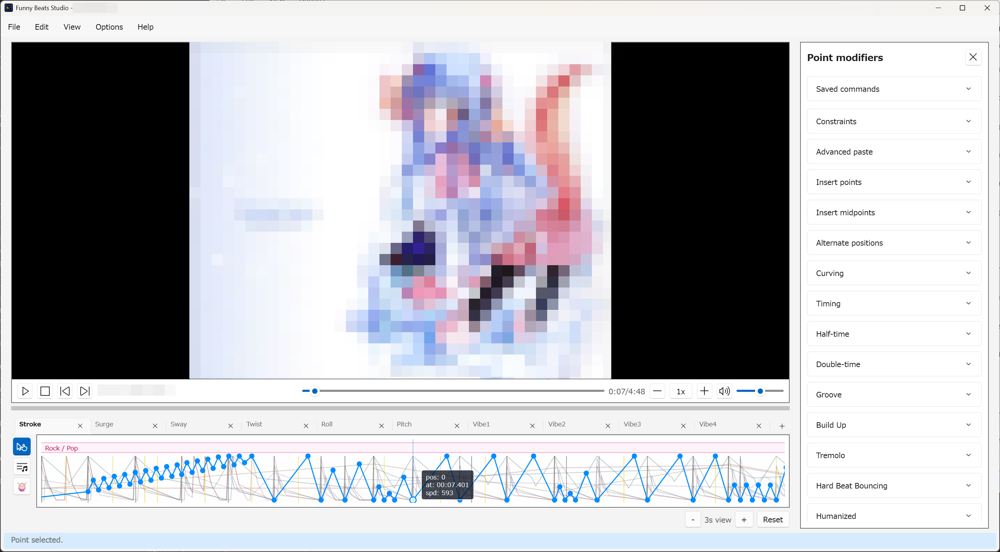

# Point Editing

Point editing is where generated or imported `.funscript` data becomes normal
timeline data. Use it to correct timing, adjust positions, add missing motion,
and apply local decorations before export.

## Point editing layer

Point commands work on the visible axis tab in the point-editing layer.
Selecting exactly one point seeks the editor to that timestamp. Selecting
multiple points changes the selection without moving playback.

Common actions:

- click a point to select it;
- drag selected points to move them in time and position;
- hold `Shift` while dragging to snap moved points to nearby accepted beats;
- drag empty timeline space to rectangle-select points;
- use `Ctrl+A`, `Ctrl+C`, `Ctrl+X`, and `Ctrl+V` for basic selection and
  clipboard edits.

Drag readouts show the moved point position, timestamp, and speed while you are
moving points. The readout stays inside the visible timeline panel.

Clicking a point that is already selected moves the current timestamp to that
point. If several points are selected, the selection stays intact.

## Add and delete points

Use `Enter` or `Edit > Add point at playhead` to add a `Position = 50` point on
the active axis at the current playhead timestamp. Playback does not stop, so
this is useful for manual live tapping.

Right-click the timeline for location-aware point commands:

- `Add point here` adds a point at the clicked timestamp;
- `Delete point` removes the current point selection;
- `Insert single midpoints` adds one midpoint between selected neighboring
  points;
- `Insert points on beat` adds interpolated points on beat timestamps between
  selected endpoints;
- `Reverse positions` flips selected positions with `100 - position`.

All committed point edits are undoable. No-op commands, such as adding a point
where one already exists, report no change instead of creating an Undo entry.

## Snap and align

Use `Snap to nearest beat` to move selected points onto nearby beat markers.
Use `Align selection to beat span` when a selected point range should be
retimed across a selected beat span.

Beat snapping depends on the current project beat grid. Repair the beat grid
first when point snapping consistently lands in the wrong place.

## Point modifiers

Use `Edit > Point modifiers...` or `Ctrl+M` after selecting committed points.
Point modifiers transform existing points directly; they do not use the Motion
generation preview.

Useful modifier groups:

- `Constraints`: repair selected speed violations by changing positions only.
- `Advanced paste`: paste copied points at the current timestamp with backward,
  mirrored-backward, overwrite, and repeat controls.
- `Insert points` and `Insert midpoints`: add helper points.
- `Alternate positions`, `Maximize segment speed`, `Curving`, and `Timing`:
  reshape selected motion. Maximize segment speed needs two points on one axis,
  preserves timestamps and each original rise/fall direction, and uses the
  smaller of its own ceiling and the overall speed ceiling.
- `Half-time`, `Double-time`, `Groove`, `Build Up`, `Tremolo`,
  `Hard Beat Bouncing`, and `Humanized`: apply rhythm-style decorations.

`Maximize segment speed` evaluates the timestamp-ordered selected points on
each axis, even when unselected points lie between them. Unselected points stay
unchanged; connections from changed points to those unselected points are not
checked against either speed ceiling. Equal-position runs alternate direction:
positions `0..50` start upward, while positions `51..100` start downward.

Each modifier has its own `Apply` button. A successful apply is one undoable
edit, and the result points remain selected so you can chain another modifier
intentionally.

### Saved commands

After a modifier changes the timeline, use `Register last...` in the
`Saved commands` panel at the top of Point modifiers, above `Constraints`, to
give that exact operation and its effective values a name. Expand the panel,
then click anywhere on a saved row except its trash button to apply those values
to the points selected at click time. It does not restore the old selection or
copy values into the ordinary modifier controls.

Hover a row to review its operation, saved values, current target, and any
reason it is unavailable. The number in the left drag handle is the row's
current shortcut position. Drag that numbered handle to reorder rows; the first
30 positions can be invoked from the points timeline with the saved-command
shortcuts listed in the Keyboard Shortcuts guide. Use the trash button to remove
it. Insert Points saved commands require selected anchors and never use the
playhead-only variant. Saved commands are shared between projects and survive
app restarts.

For Humanized, a Random seed that was blank when you clicked Apply remains
automatic in the registered command, so each saved-command invocation chooses a
new seed. The seed generated for the ordinary Apply is shown in the field after
that edit. If you entered a seed, including `0`, the registered command reuses it.

When an Advanced paste source starts and ends on the same point position, repeat
copies share that boundary so peak or bounce loops stay connected.

## Hard Beat Bouncing tips

`Hard Beat Bouncing` adds a short rebound-and-return pattern around selected
landing points.

- `Bottom only` decorates local low points.
- `Top only` decorates local high points.
- `Both` decorates either side.
- `Amount` controls rebound distance.
- `Duration` controls spacing between bounce nodes.
- `Count` controls how many rebound-and-return cycles are requested.
- `Offset` moves the whole bounce sequence before, centered on, or after the
  landing.

If the full bounce cannot fit between neighboring points or would exceed the
configured maximum speed, the app may reduce the bounce count or travel. A
single selected point can be bounced using its neighboring timeline points as
the time boundaries.

## Visual checks

Point tooltips show position, timestamp, and previous-segment speed. Near panel
edges, tooltips and drag readouts stay inside the visible timeline area.

Segments that exceed the active maximum speed threshold render as speed
violations. Use this as a review signal, then repair the selection manually or
with the `Constraints` modifier.
