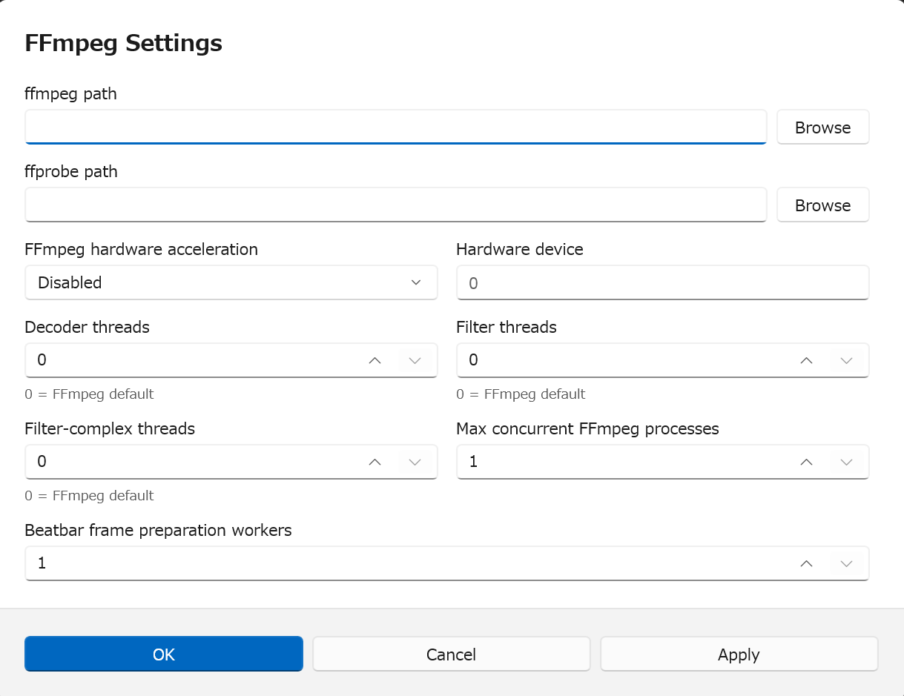

# Settings, Dependencies, and Diagnostics

FunnyBeatsStudio keeps project data, application settings, external tools, and
diagnostics separate. This helps projects stay portable while still allowing
local media and model workflows.

## Basic settings

Open `Options > Settings`.

The Basic settings panel includes:

- UI language;
- completion sound for busy operations;
- beat snap range in milliseconds;
- minimum accepted audio beat confidence;
- script export format.

Language changes apply on the next app launch.

The minimum accepted audio beat confidence filters which analyzed markers are
shown and used for snapping. It does not change stored analysis results and is
not the same as HighPrecision detection sensitivity.

## Script export format

The export section chooses the `.funscript` format used by `File > Export
funscript`:

- `1.0`: per-axis sibling files;
- `1.1`: single-file multi-axis with `axes`;
- `2.0`: single-file multi-axis with `channels`.

See [Import, export, and files](./import-export-and-files.md) for the practical
format differences.

## FFmpeg Settings

Open `Options > FFmpeg Settings`.

This panel controls media-tool resolution and media-processing performance:

- explicit `ffmpeg` path;
- explicit `ffprobe` path;
- FFmpeg hardware acceleration;
- optional hardware device;
- decoder, filter, and filter-complex thread counts;
- maximum concurrent FFmpeg processes;
- beatbar frame preparation workers.

Resolution order for `ffmpeg` and `ffprobe` is:

1. explicit user-configured executable path;
2. executable-relative `tools/ffmpeg/bin`;
3. `PATH`.

Use explicit paths when troubleshooting. Keep `ffmpeg.exe` and `ffprobe.exe`
from the same FFmpeg distribution when possible.

Thread counts of `0` mean FFmpeg default behavior. Increase concurrency and
worker counts carefully; more parallelism can make the machine less responsive
or exhaust GPU/CPU resources.

## Storage Location

Open `Options > Storage Location`.

This panel controls where app-managed external artifacts live. When unset, the
default root is under local application data for FunnyBeatsStudio. A custom root
moves the managed layout under that folder for future checks and installs.

Changing the storage root does not migrate, copy, or delete existing files. It
clears verified artifact targets, so optional Python, stem, and beatbar AI
assets must be checked again before dependent workflows are enabled.

## Python Runtime

Open `Options > Python Runtime`.

This panel manages the pinned app-owned Python worker runtime used by approved
external workers. It can:

- check the installed runtime;
- download and extract the pinned runtime;
- cancel an operation.

The app does not use your global Python installation by default, does not modify
`PATH`, and does not write runtime provenance to project files.

## Audio Stem Separation Model

Open `Options > Audio Stem Separation Model`.

This panel manages optional HighPrecision audio-analysis assets. It can check or
download the approved NVIDIA CUDA stem package and model assets after explicit
user action.

The panel cannot be used until the Python runtime target is current. High
precision beat analysis is enabled only when both the Python runtime and stem
assets are verified.

## Beatbar AI Model

Open `Options > Beatbar AI Model`.

This panel manages optional local DINOv3 assets for State (AI) and Cue (AI)
beatbar workflows. It is separate from the audio stem model panel.

The panel can:

- check local package and model status;
- download approved assets;
- cancel an operation;
- accept the current local artifact notice; and
- save or clear a masked Hugging Face access token for explicit gated downloads.

The token is stored in protected local credential storage, used only for the
explicit download action, and must not be written to settings, project files, or
logs. The token box is never pre-filled; newly typed text is pending session
input until saved or used for download.
There is no CPU fallback for the model-backed beatbar path. Deterministic
beatbar detectors remain available without these AI assets.

## Diagnostics

Open `Options > Diagnostics`.

Diagnostics are local files for troubleshooting. They can include:

- external command `.log` files;
- HighPrecision rhythm diagnostic `.json` files;
- motion generation diagnostic `.json` files;
- beatbar analysis diagnostic `.json` files;
- video replacement diagnostic `.json` or `.txt` files;
- unhandled exception `.log` files.

Diagnostics are not project data. Do not paste local diagnostic paths, local
media paths, or machine-specific details into public issue comments, release
notes, or pull request text.

Use the diagnostics panel to open the logs folder or clean known diagnostic
roots. Cleanup targets only the known diagnostic file types under known roots.

## Last-used workflow settings

Some panels remember last-used values in application settings:

- Motion generation stores preview inputs after `Generate preview`.
- Video replacement export stores export inputs when an export starts.

These settings are restored on the next app launch. They are not saved in
project files and do not persist generated previews, render plans, diagnostics,
source pools, random seeds, or local output media paths.

## Settings buttons

Settings panels use:

- `OK`: save and close.
- `Apply`: save and keep the panel open.
- `Cancel`: discard pending edits and close.

Artifact check and download buttons are explicit actions. `Apply` saves pending
settings but does not start downloads or checks.
